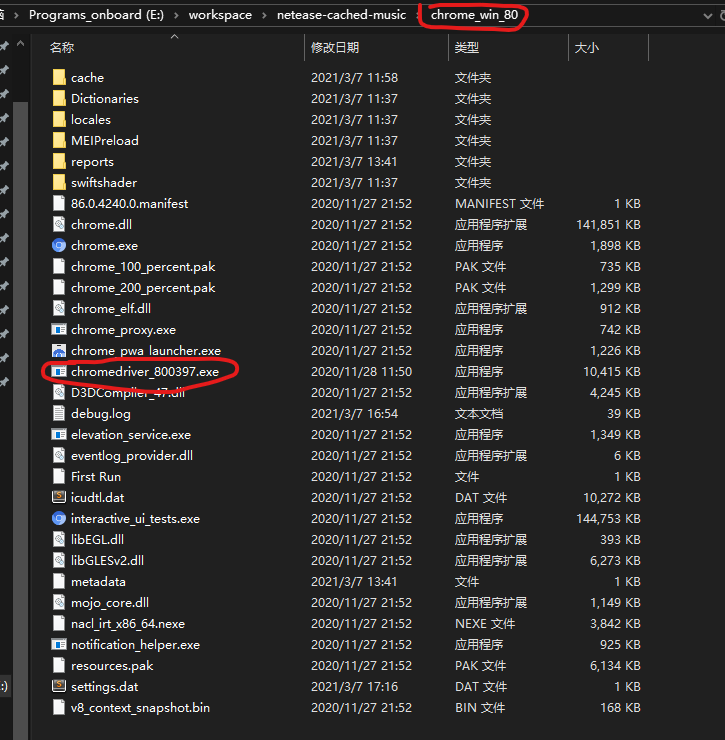
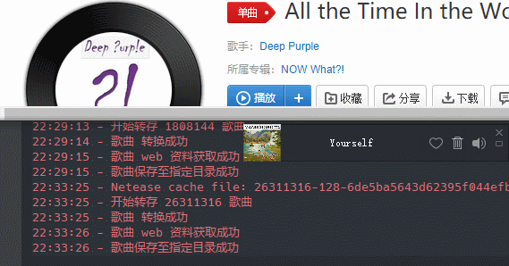
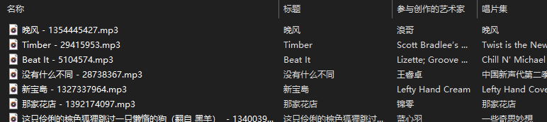

# 网易云音乐缓存文件 --> MP3
>网易云音乐的缓存文件经过处理,也就是异或加密了的,要获得MP3文件,需要解密. 这个仅用于学习. 请大家尊重音乐的版权.其实大多数歌曲都是可以下载的

## 介绍

这是一个用于获取网易云音乐缓存文件的mp3文件的 python script.

利用缓存文件,解密（异或163的hex）得到MP3文件, 并通过其metadata,命名文件,
~~顺便从api或者网页抓取歌词,详细介绍可以看[这里](https://mbinary.coding.me/decrypt-netease-music.html)~~

改成了从music.163.com获取歌曲的封面/歌词/元数据

## 使用

### 获得缓存文件
>  手机上的在 `netease/cloudmusic/Cache/Music1`里,将其复制到电脑上。
>
>  windows：用户文件夹 AppData/Local/Netease/CloudMusic/Cache/Cache 里面。`

脚本会监听文件夹变动，和网易云客户端一起开启后，客户端缓存一个脚本就转存一个

### 另外下载的chrome和chromedriver
[下载有h264支持的chromium](https://github.com/Hibbiki/chromium-win64)

[下载和chromium版本对应的webdriver](https://chromedriver.chromium.org/downloads)

要这么放：

打包好的里面加了这两个东西

### 运行
* 环境搭好，在命令行模式下
  `python3 decrypt.py`

* 使用打包好的

  先修改 `decrypt.config`

  > srcDir：网易云的缓存文件夹
  >
  > desDir：输出

  再运行 `decrypt.exe`

## 展示
监听文件变动和下载，因为网易云的缓存策略所以 监听到要下载的歌总是慢客户端一步

## 结果
 你就可以到缓存文件目录的父目录下 看到 音乐文件：

## 贡献
欢迎 fork & PR

## Licence
[MIT](LICENCE)

